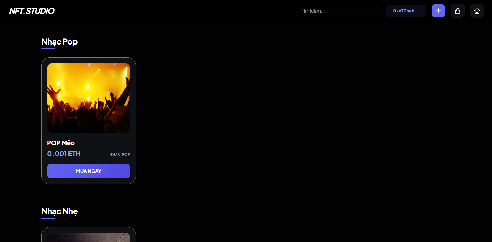
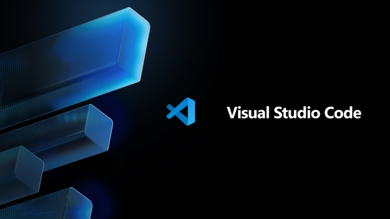
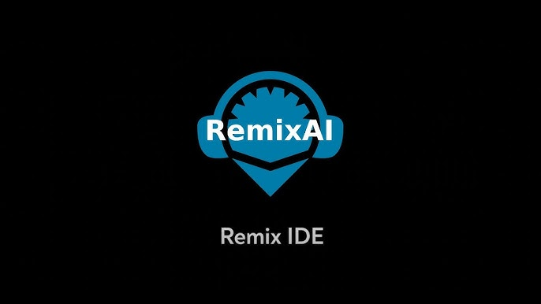
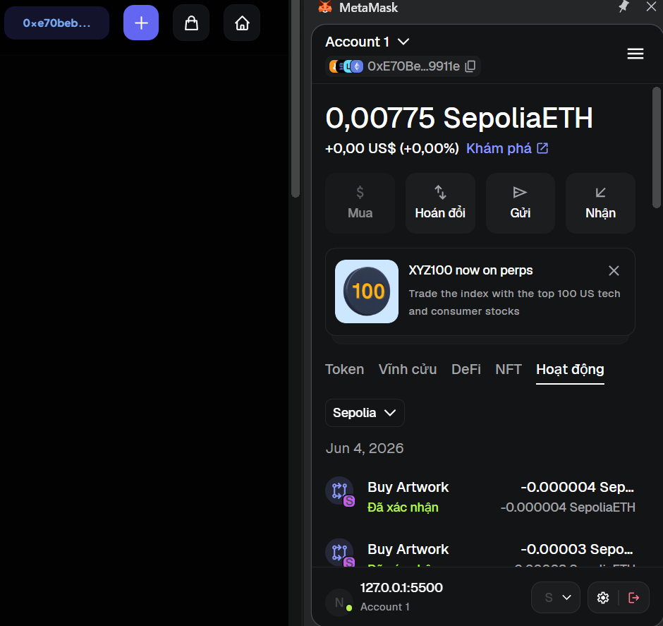
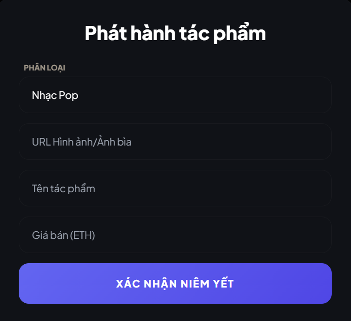
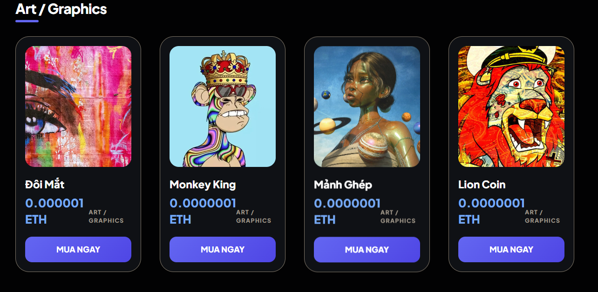
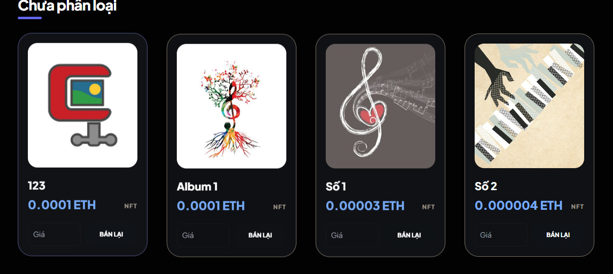

# NFT.STORE: WEB3 COPYRIGHT MARKETPLACE

  

## Tổng quan dự án
Mô tả ngắn: Hệ thống ứng dụng Web3 tối giản (Minimalism) cho phép nghệ sĩ số hóa tác phẩm nghệ thuật (Hình ảnh/Âm nhạc) thành NFT trực tiếp từ thiết bị cá nhân lên mạng lưới Blockchain.

Môi trường thử nghiệm: Mạng thử nghiệm Sepolia Ethereum (Testnet).

Công nghệ cốt lõi:
* Smart Contract: Solidity (Viết và biên dịch qua Remix IDE).
* Giao diện (Front-end): HTML5, Tailwind CSS (Thiết kế High-End Minimalist).
* Kết nối Blockchain: Thư viện ethers.js & Ví điện tử MetaMask.

<table align="center" width="100%" style="border-collapse: collapse; border: none;">
  <tr style="border: none;">
    <td align="center" width="33.33%" style="border: none; padding: 10px;">
      
    </td>
    <td align="center" width="33.33%" style="border: none; padding: 10px;">
      
    </td>
    <td align="center" width="33.33%" style="border: none; padding: 10px;">
      
    </td>
  </tr>
</table>

## Tính năng nổi bật
* ⚡ Mã hóa Trực tiếp (Direct Minting): Chuyển đổi dữ liệu hình ảnh, tệp âm thanh thành chuỗi Base64 kết hợp Metadata tên tác phẩm để ghi trực tiếp vào khối.
* 🔒 Cơ chế Ẩn sản phẩm thông minh: Khi phát sinh giao dịch mua bán thành công trên MetaMask, trạng thái isForSale tự động chuyển về false.
* 📂 Quản lý danh mục minh bạch: Chỉ hiển thị tác phẩm đang rao bán công khai.
* 🔍 Bộ lọc thời gian thực: Tìm kiếm và truy xuất ID sản phẩm ngay lập tức mà không cần tải lại trang.

## Quy trình hoạt động

<table width="100%" style="border-collapse: collapse; border: none;">
  <tr style="border: none;">
    <td width="50%" valign="top" style="border: none; padding: 15px; background: #ffffff;">
      <h3>Kết nối ví</h3>
      
Người dùng tích hợp ví MetaMask, hệ thống tự động nhận diện địa chỉ ví công khai.

       
      

    </td>
    <td width="50%" valign="top" style="border: none; padding: 15px; background: #ffffff;">
      <h3>Phát hành (MINT)</h3>
      
Tải file lên &rarr; Nhập tên &rarr; Đặt giá bằng đồng ETH &rarr; Ký giao dịch trên MetaMask để đẩy lên Smart Contract.

       
      

    </td>
  </tr>
  <tr style="border: none;">
    <td width="50%" valign="top" style="border: none; padding: 15px; background: #ffffff;">
      <h3>Mua bán (BUY)</h3>
      
Người mua nhấn "MUA NGAY" tại trang chủ &rarr; MetaMask tự động tính toán phí Gas.

       
      

    </td>
    <td width="50%" valign="top" style="border: none; padding: 15px; background: #ffffff;">
      <h3>Chuyển quyền sở hữu</h3>
      
Hệ thống cập nhật owner mới, sản phẩm tự động gỡ khỏi sàn và chuyển vào danh mục "Đã bán" của người mua.

       
      

    </td>
  </tr>
</table>

## Thành tựu đạt được
* ✅ Giao dịch thực tế: Tích hợp thành công các giao dịch trên mạng Sepolia.
* ✅ Tối ưu hóa dữ liệu: Giải quyết triệt để lỗi trùng lặp ảnh khi nạp danh sách dữ liệu từ mạng lưới về giao diện người dùng.
* ✅ UX/UI Hiện đại: Thanh menu ẩn đổi màu độc lập với background, mang lại trải nghiệm tối giản tuyệt đối.
